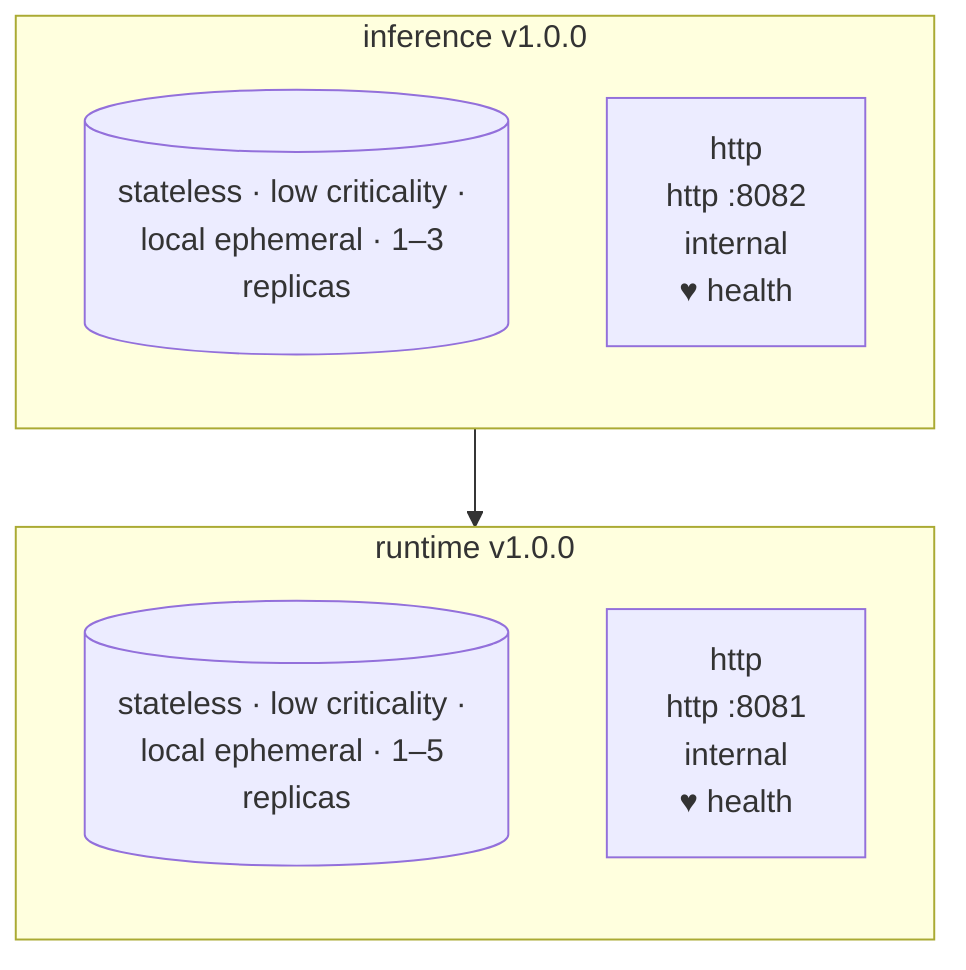

# Pacto Demo

**Runtime contracts for cloud-native services.**

> [github.com/trianalab/pacto](https://github.com/trianalab/pacto)

```
$ pacto graph services/api/pacto

api@1.0.0
└─ inference@1.0.0
   └─ runtime@1.0.0
```

```
$ ./scripts/demo-breaking-change.sh
```

**Classification:** `BREAKING`

| Classification | Path | Type | Reason | Old | New |
|---|---|---|---|---|---|
| NON_BREAKING | `service.version` | modified | service.version modified | `1.0.0` | `2.0.0` |
| NON_BREAKING | `service.image` | modified | service.image modified | `ghcr.io/trianalab/pacto-demo/runtime:1.0.0` | `ghcr.io/trianalab/pacto-demo/runtime:2.0.0` |
| BREAKING | `interfaces.port` | modified | interfaces.port modified | `8081` | `9090` |
| BREAKING | `openapi.paths[/predict]` | removed | API path /predict removed | `/predict` |  |
| BREAKING | `schema.properties[model_path]` | removed | configuration property model_path removed | `model_path` |  |

```
$ pacto explain services/inference/pacto

Service: inference@1.0.0
Owner: team/ml
Pacto Version: 1.0

Runtime:
  Workload: service
  State: stateless
  Persistence: local/ephemeral
  Data Criticality: low

Interfaces (1):
  - http (http, port 8082, internal)

Dependencies (1):
  - oci://ghcr.io/trianalab/pacto-demo/runtime (^1.0.0, required)

Scaling: 1-3
```

---

## The Problem

Services depend on each other through APIs and configuration. But today this knowledge lives in documentation, tribal knowledge, and Slack threads.

CI cannot understand service compatibility. Breaking changes reach production.

**Pacto turns service contracts into machine-readable artifacts** -- versioned in OCI registries, validated in CI, diffed on every pull request.

---

## Pacto vs. OpenAPI

| Capability | OpenAPI | Pacto |
|---|---|---|
| API schema | yes | yes |
| Configuration schema | -- | yes |
| Service dependencies | -- | yes |
| Runtime characteristics | -- | yes |
| Breaking change detection | limited | yes |
| OCI distribution | -- | yes |
| Dependency graph | -- | yes |

---

## Architecture

```
api@1.0.0             public gateway     :8080
└─ inference@1.0.0    ML inference       :8082
   └─ runtime@1.0.0   model execution    :8081
```

Three Go services built with [Huma](https://huma.rocks). Each publishes a contract describing:

- Its **API** (OpenAPI spec, auto-generated from Go code)
- Its **configuration** (JSON Schema, auto-generated from Go structs)
- Its **dependencies** (OCI references with semver constraints)

---

## The Contract

```yaml
# services/inference/pacto/pacto.yaml

pactoVersion: "1.0"

service:
  name: inference
  version: 1.0.0

interfaces:
  - name: http
    type: http
    port: 8082
    contract: interfaces/openapi.json       # auto-generated

configuration:
  schema: configuration/schema.json         # auto-generated

dependencies:
  - ref: oci://ghcr.io/trianalab/pacto-demo/runtime
    required: true
    compatibility: "^1.0.0"

runtime:
  workload: service
  state:
    type: stateless
  health:
    interface: http
    path: /health
```

Full contract reference: [trianalab.github.io/pacto/contract-reference](https://trianalab.github.io/pacto/contract-reference/)

---

## What Pacto Understands

From a single `pacto.yaml`, Pacto extracts:

- **Interfaces** -- protocols, ports, visibility, OpenAPI endpoints
- **Configuration** -- every property, type, default, and whether it's required
- **Dependencies** -- OCI references with semver compatibility constraints
- **Runtime** -- workload type, state model, persistence, data criticality
- **Scaling** -- replica bounds and upgrade strategy

All of this is validated, diffed, graphed, and documented automatically.

---

## CI Integration

Pacto runs in CI to catch contract issues before they reach production.

```
validate contracts
        │
        ▼
diff against published version (detect breaking changes)
        │
        ▼
generate documentation
        │
        ▼
publish contract to OCI registry
```

This repository demonstrates the full pipeline using [pacto-actions](https://github.com/trianalab/pacto-actions). Every workflow runs automatically on push to `main`. Click any workflow to see the output in the job summary.

| Capability | Workflow | What it demonstrates |
|------------|----------|----------------------|
| Validation | [Validate & Explain](../../actions/workflows/demo-validate.yml) | `pacto validate` + `pacto explain` on every contract |
| Dependency graph | [Dependency Graph](../../actions/workflows/demo-graph.yml) | `pacto graph` resolves the full service tree |
| Breaking changes | [Breaking Change Detection](../../actions/workflows/demo-breaking-change.yml) | Applies 4 breaking changes, diffs against published OCI artifact |
| Documentation | [Contract Documentation](../../actions/workflows/demo-docs.yml) | `pacto doc` generates Markdown with diagrams and tables |
| Packaging | [Pack Contract Bundles](../../actions/workflows/demo-pack.yml) | `pacto pack` creates OCI-ready bundles |
| Full CI | [Pacto CI](../../actions/workflows/ci-pacto.yml) | Validate, diff, document, and push to GHCR |

---

## Contract Validation

```
$ pacto validate services/runtime/pacto
services/runtime/pacto is valid

$ pacto validate services/inference/pacto
services/inference/pacto is valid

$ pacto validate services/api/pacto
services/api/pacto is valid
```

---

## Contract Documentation

```
$ pacto doc services/inference/pacto
```

<details>
<summary>Full output (click to expand)</summary>

# inference

**inference** `v1.0.0` is a `stateless` `service` workload exposing 1 interface with 1 dependency. Owned by `team/ml`, packaged as `ghcr.io/trianalab/pacto-demo/inference:1.0.0` (`public`), scales from `1` to `3` replicas.

| Concept | Value | Description |
|---------|-------|-------------|
| **Workload** | `service` | A long-running process that serves requests continuously |
| **State** | `stateless` | Does not retain data between requests; any instance can handle any request (e.g. an API proxy or a service whose in-memory data can be fully rebuilt from external sources) |
| **Persistence scope** | `local` | Data is confined to a single instance and not shared across replicas (e.g. in-memory caches, local files, embedded databases) |
| **Persistence durability** | `ephemeral` | Data can be lost on restart without impact; used for in-memory caches, temp files, or reconstructible state |
| **Data criticality** | `low` | Loss of data has minimal business impact; can be regenerated or is non-essential |
| **Upgrade strategy** | `rolling` | New instances are brought up incrementally while old ones are drained, ensuring zero downtime |
| **Graceful shutdown** | `15s` | Time allowed for in-flight requests to complete before termination |

For more information on contract concepts, see the [Contract Reference](https://trianalab.github.io/pacto/contract-reference/).

## Table of Contents

- [1. Architecture](#1-architecture)
- [2. Interfaces](#2-interfaces)
  - [2.1. HTTP Interface: http](#21-http-interface-http)
- [3. Configuration](#3-configuration)
- [4. Dependencies](#4-dependencies)
  - [4.1. runtime](#dep-runtime)
    - [4.1.1. Runtime](#dep-runtime-runtime)
    - [4.1.2. Interfaces](#dep-runtime-interfaces)
    - [4.1.3. Configuration](#dep-runtime-configuration)

## 1. Architecture



## 2. Interfaces

| Name | Type | Port | Visibility |
|------|------|------|------------|
| `http` | `http` | `8082` | `internal` |

### 2.1. HTTP Interface: http

The `http` interface is `internal` and exposes port `8082`. It owns the health path under `/health`.

| Method | Path | Summary |
|--------|------|---------|
| `GET` | `/health` | Get health |
| `POST` | `/infer` | Post infer |
| `POST` | `/infer/batch` | Post infer batch |

## 3. Configuration

| Property | Type | Description | Default | Required |
|----------|------|-------------|---------|----------|
| `host` | `string` | Host address to bind the server | `0.0.0.0` | No |
| `log_level` | `string` | Log level (debug, info, warn, error) | `info` | No |
| `max_retries` | `integer` | Maximum number of retries for runtime calls | `3` | No |
| `port` | `integer` | Port to listen on | `8082` | No |
| `runtime_url` | `string` | URL of the runtime service | — | Yes |
| `timeout_seconds` | `integer` | Request timeout in seconds | `30` | No |

## 4. Dependencies

| Reference | Compatibility | Required |
|-----------|---------------|----------|
| `oci://ghcr.io/trianalab/pacto-demo/runtime` | `^1.0.0` | Yes |

<details id="dep-runtime">
<summary><h3>4.1. runtime <code>v1.0.0</code></h3></summary>

**runtime** `v1.0.0` is a `stateless` `service` workload exposing 1 interface. Owned by `team/platform`, packaged as `ghcr.io/trianalab/pacto-demo/runtime:1.0.0` (`public`), scales from `1` to `5` replicas.

<h4 id="dep-runtime-runtime">4.1.1. Runtime</h4>

| Concept | Value | Description |
|---------|-------|-------------|
| **Workload** | `service` | A long-running process that serves requests continuously |
| **State** | `stateless` | Does not retain data between requests; any instance can handle any request (e.g. an API proxy or a service whose in-memory data can be fully rebuilt from external sources) |
| **Persistence scope** | `local` | Data is confined to a single instance and not shared across replicas (e.g. in-memory caches, local files, embedded databases) |
| **Persistence durability** | `ephemeral` | Data can be lost on restart without impact; used for in-memory caches, temp files, or reconstructible state |
| **Data criticality** | `low` | Loss of data has minimal business impact; can be regenerated or is non-essential |
| **Upgrade strategy** | `rolling` | New instances are brought up incrementally while old ones are drained, ensuring zero downtime |
| **Graceful shutdown** | `15s` | Time allowed for in-flight requests to complete before termination |

<h4 id="dep-runtime-interfaces">4.1.2. Interfaces</h4>

| Name | Type | Port | Visibility |
|------|------|------|------------|
| `http` | `http` | `8081` | `internal` |

<h5>4.1.2.1. HTTP Interface: http</h5>

The `http` interface is `internal` and exposes port `8081`. It owns the health path under `/health`.

| Method | Path | Summary |
|--------|------|---------|
| `GET` | `/health` | Get health |
| `GET` | `/models` | Get models |
| `POST` | `/predict` | Post predict |

<h4 id="dep-runtime-configuration">4.1.3. Configuration</h4>

| Property | Type | Description | Default | Required |
|----------|------|-------------|---------|----------|
| `gpu_enabled` | `boolean` | Enable GPU acceleration | `false` | No |
| `host` | `string` | Host address to bind the server | `0.0.0.0` | No |
| `log_level` | `string` | Log level (debug, info, warn, error) | `info` | No |
| `max_batch_size` | `integer` | Maximum batch size for inference requests | `32` | No |
| `model_path` | `string` | Path to the ML model files | — | Yes |
| `port` | `integer` | Port to listen on | `8081` | No |

</details>

---

`team: ml` `tier: ml`

Generated by [Pacto](https://trianalab.github.io/pacto)

</details>

---

## Contract Packaging

```
$ pacto pack services/runtime/pacto -o dist/runtime.tar.gz
Packed runtime@1.0.0 -> dist/runtime.tar.gz
```

---

## Quickstart

Prerequisites: [Go 1.23+](https://go.dev/dl/), [Pacto CLI](https://github.com/trianalab/pacto)

```bash
# validate all contracts
pacto validate services/runtime/pacto
pacto validate services/inference/pacto
pacto validate services/api/pacto

# resolve the full dependency graph
pacto graph services/api/pacto

# inspect a contract
pacto explain services/inference/pacto

# generate documentation
pacto doc services/inference/pacto

# package a contract as an OCI bundle
pacto pack services/runtime/pacto -o dist/runtime.tar.gz

# simulate breaking changes and detect them
./scripts/demo-breaking-change.sh
```

---

## How the Demo Is Built

Each service uses [Huma](https://huma.rocks) to define typed HTTP handlers in Go. A code generator (`go run scripts/generate.go`) extracts:

- **OpenAPI specs** from route registrations &rarr; `pacto/interfaces/openapi.json`
- **JSON Schema** from config structs via reflection &rarr; `pacto/configuration/schema.json`

Both artifacts are referenced by the Pacto contract and included in the OCI bundle.

```
services/runtime/
├── cmd/main.go                      # service entrypoint
├── service/
│   ├── handlers.go                  # HTTP handlers
│   └── config.go                    # config struct
└── pacto/
    ├── pacto.yaml                   # contract
    ├── interfaces/openapi.json      # generated OpenAPI spec
    └── configuration/schema.json    # generated config schema
```

---

## License

MIT
